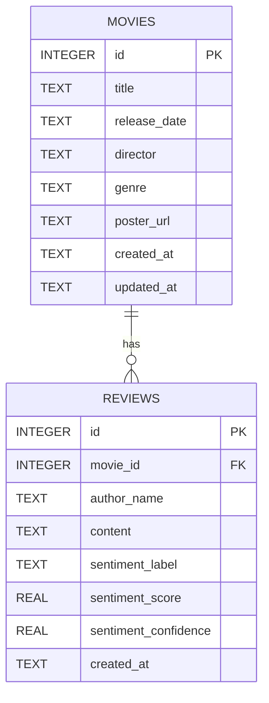

# 미션 18 ERD 초안

보고서에 사용할 데이터베이스 구조도 초안입니다. 최종 보고서에서는 이 구조를 이미지로 캡처하거나 다이어그램으로 다시 그려 넣으면 됩니다.

## 관계 설명

- 영화 1개는 리뷰 여러 개를 가질 수 있습니다.
- 리뷰 1개는 반드시 영화 1개에 연결됩니다.
- 영화 삭제 시 연결된 리뷰도 함께 삭제하는 방향으로 구현합니다.
- 평균 평점은 별도 테이블에 저장하지 않고, 리뷰의 `sentiment_score` 평균으로 계산합니다.

## 보고서에 적을 요약 문장

본 서비스는 영화 정보와 사용자 리뷰를 분리해서 저장한다. `movies` 테이블은 영화의 기본 정보를 관리하고, `reviews` 테이블은 각 영화에 연결된 리뷰와 감성 분석 결과를 저장한다. 영화와 리뷰는 1:N 관계이며, 영화별 평균 점수는 리뷰 감성 점수의 평균으로 계산한다.
