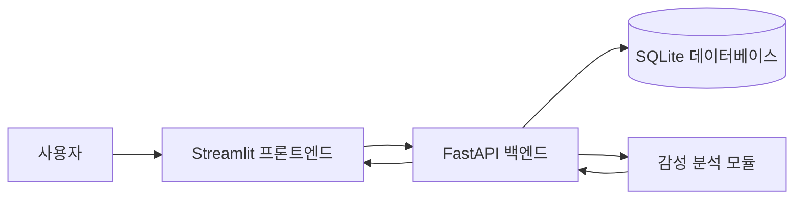
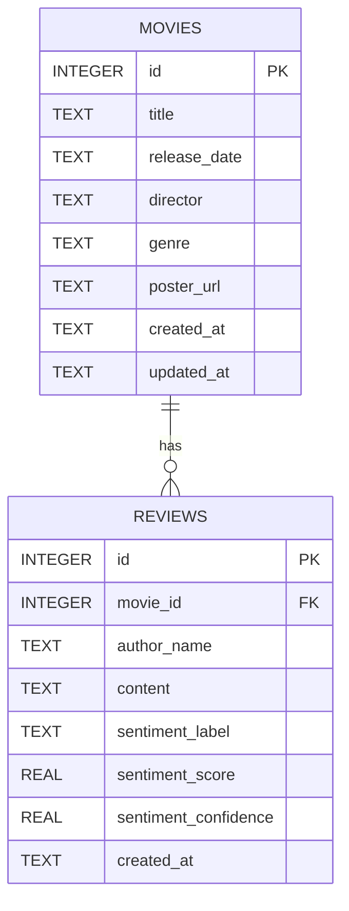
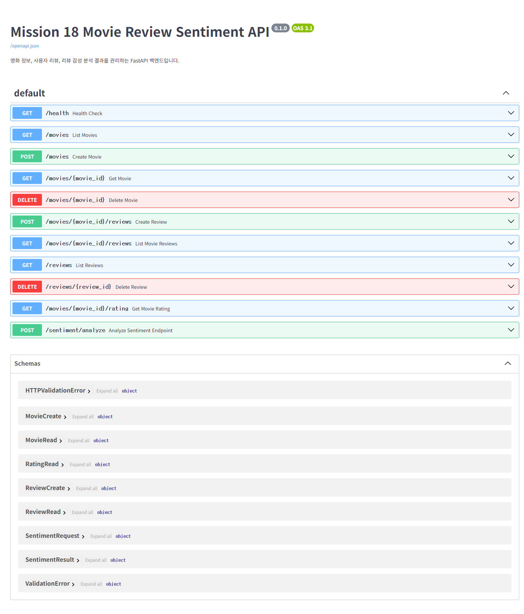
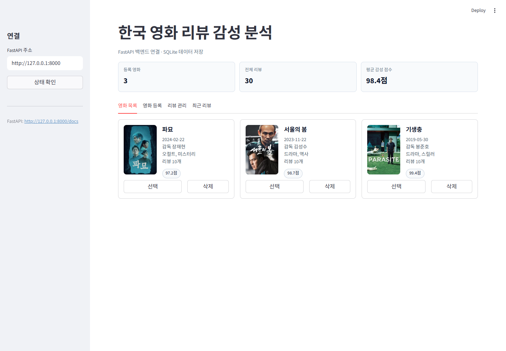
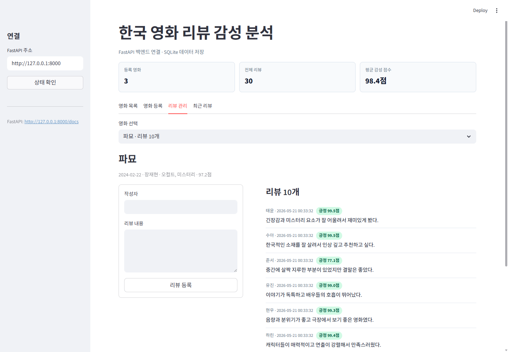

# 미션 18 보고서

## 1. 서비스 개요

본 프로젝트는 한국 영화 정보, 사용자 리뷰, 리뷰 감성 분석 결과를 표시하는 웹 애플리케이션이다. 프론트엔드는 Streamlit으로 구현했고, 백엔드는 FastAPI로 구현했다. 사용자는 Streamlit 화면에서 영화 목록을 확인하고, 영화를 등록하고, 특정 영화에 리뷰를 작성할 수 있다. 리뷰가 등록되면 백엔드에서 감성 분석을 수행한 뒤 결과를 리뷰와 함께 저장한다.

이번 서비스의 핵심 목표는 단일 화면 앱을 만드는 것이 아니라, 프론트엔드와 백엔드, 데이터베이스, 감성 분석 로직을 분리해서 연결하는 구조를 경험하는 것이다.

## 2. 사용 기술

| 구분 | 기술 |
| --- | --- |
| 프론트엔드 | Streamlit |
| 백엔드 | FastAPI |
| 데이터베이스 | SQLite |
| 데이터 검증 | Pydantic |
| API 통신 | requests |
| 테스트 | pytest, FastAPI TestClient |
| 감성 분석 | Hugging Face `cringepnh/koelectra-korean-sentiment` |

## 3. 서비스 구조도



구조는 다음과 같다.

1. 사용자가 Streamlit 화면에서 영화 또는 리뷰를 입력한다.
2. Streamlit은 직접 데이터를 저장하지 않고 FastAPI API를 호출한다.
3. FastAPI는 요청 데이터를 검증한 뒤 SQLite 데이터베이스에 저장한다.
4. 리뷰 등록 시 FastAPI는 감성 분석 모듈을 호출한다.
5. 감성 분석 결과는 리뷰 데이터와 함께 저장된다.
6. Streamlit은 FastAPI에서 영화 목록, 리뷰 목록, 평균 감성 점수를 다시 받아 화면에 표시한다.

## 4. 데이터베이스 구조도 ERD



`movies` 테이블은 영화 제목, 개봉일, 감독, 장르, 포스터 URL을 저장한다. `reviews` 테이블은 특정 영화에 연결된 리뷰, 작성자, 리뷰 내용, 감성 분석 결과를 저장한다. 영화 1개는 여러 리뷰를 가질 수 있으므로 두 테이블은 1:N 관계이다. 영화가 삭제되면 연결된 리뷰도 함께 삭제되도록 설계했다.

## 5. 주요 API

| Method | Path | 기능 |
| --- | --- | --- |
| GET | `/health` | 백엔드 상태 확인 |
| POST | `/movies` | 영화 등록 |
| GET | `/movies` | 전체 영화 목록 조회 |
| GET | `/movies/{movie_id}` | 특정 영화 조회 |
| DELETE | `/movies/{movie_id}` | 특정 영화 삭제 |
| POST | `/movies/{movie_id}/reviews` | 특정 영화에 리뷰 등록 |
| GET | `/movies/{movie_id}/reviews` | 특정 영화의 리뷰 목록 조회 |
| GET | `/reviews` | 최근 리뷰 목록 조회 |
| DELETE | `/reviews/{review_id}` | 특정 리뷰 삭제 |
| GET | `/movies/{movie_id}/rating` | 영화별 평균 감성 점수 조회 |
| POST | `/sentiment/analyze` | 감성 분석 단독 테스트 |

## 6. 감성 분석 방식

현재 버전은 Hugging Face의 `cringepnh/koelectra-korean-sentiment` 모델을 사용한다. 이 모델은 한국어 영화 리뷰 데이터셋인 NSMC를 기반으로 학습된 KoELECTRA 계열 감성 분석 모델이며, 영화 리뷰를 긍정 또는 부정으로 분류한다.

결과는 다음 세 가지 값으로 저장한다.

- `sentiment_label`: `positive`, `negative`
- `sentiment_score`: 평균 계산에 사용하는 0.0부터 1.0 사이 점수
- `sentiment_confidence`: 모델 출력 confidence

모델 출력이 긍정이면 `sentiment_score`는 모델 confidence와 같은 값으로 저장한다. 모델 출력이 부정이면 영화별 평균 점수 계산을 위해 `1 - confidence` 값을 저장한다. 따라서 평균 감성 점수는 긍정적인 리뷰가 많을수록 1.0에 가까워진다.

## 7. 프론트엔드 화면 구성

Streamlit 화면은 다음 영역으로 구성했다.

- 연결 설정: FastAPI 주소 입력과 상태 확인
- 영화 목록: 등록된 영화 3개, 포스터, 감독, 장르, 리뷰 수, 평균 감성 점수 표시
- 영화 등록: 제목, 개봉일, 감독, 장르, 포스터 URL 입력
- 리뷰 관리: 영화 선택, 리뷰 작성, 감성 분석 결과 포함 리뷰 목록 표시
- 최근 리뷰: 최근 등록된 리뷰 10개 표시

## 8. 샘플 데이터

제출 캡처 조건을 만족하기 위해 한국 영화 3개를 등록하고 각 영화당 리뷰 10개씩 등록했다.

| 영화 | 감독 | 리뷰 수 | 평균 감성 점수 |
| --- | --- | ---: | ---: |
| 파묘 | 장재현 | 10 | 97.2점 |
| 서울의 봄 | 김성수 | 10 | 98.7점 |
| 기생충 | 봉준호 | 10 | 99.4점 |

포스터 이미지는 TMDB 포스터 페이지에서 확인한 이미지 URL을 사용했다.

## 9. FastAPI Docs 캡처



FastAPI Docs 화면에서 전체 API 목록과 요청/응답 스키마를 확인할 수 있다. 이 화면은 백엔드 API 명세 캡처로 보고서에 포함한다.

## 10. 서비스 동작 캡처

### 영화 목록 화면



영화 3개가 등록되어 있고, 각 영화의 포스터, 기본 정보, 리뷰 수, 평균 감성 점수가 표시된다.

### 리뷰 관리 화면



선택한 영화에 대해 리뷰 10개가 표시되고, 각 리뷰에는 작성자, 등록일, 감성 label, 감성 점수가 함께 표시된다.

## 11. 테스트 결과

백엔드 테스트 결과:

```text
python -m pytest tests/test_api.py -q
3 passed
```

프론트엔드 API 클라이언트 테스트 결과:

```text
python -m pytest tests/test_api_client.py -q
3 passed
```

로컬 실행 확인:

```text
backend /health: 200
movies: 3
frontend: 200
```

## 12. 문제 해결 과정

첫 번째 문제는 Streamlit 화면과 FastAPI 백엔드의 역할 분리였다. Streamlit에서 직접 데이터를 저장하지 않고, 모든 영화와 리뷰 데이터를 FastAPI API를 통해 처리하도록 API 클라이언트를 별도 파일로 분리했다.

두 번째 문제는 제출 캡처용 데이터 준비였다. 영화 3개와 각 영화당 리뷰 10개를 매번 수동으로 입력하면 시간이 오래 걸리므로, 한국 영화 샘플 데이터를 등록하는 시드 스크립트를 작성했다.

세 번째 문제는 감성 분석 모델 적용이었다. 처음에는 실행 안정성을 위해 규칙 기반 baseline을 사용했지만, 최종 버전에서는 Hugging Face의 한국어 영화 리뷰 감성 분석 모델을 백엔드에 연결했다. 모델 첫 실행 시 다운로드 시간이 걸리므로 lazy-load 구조로 만들고, 이미 저장된 리뷰는 재계산 스크립트로 다시 분석했다.

네 번째 문제는 포스터 이미지였다. 처음에는 placeholder 이미지를 사용했지만, 최종 화면 캡처의 완성도를 높이기 위해 TMDB의 실제 영화 포스터 이미지 URL로 교체했다.

다섯 번째 문제는 Streamlit 레이아웃이었다. HTML div로 Streamlit 컴포넌트를 직접 감싸면 빈 박스가 생기는 문제가 있어, `st.container(border=True)` 기반의 카드 구조로 수정했다.

## 13. 실행 방법

백엔드 실행:

```powershell
cd 미션\미션18\4팀_김도민\backend
pip install -r requirements.txt
python -m uvicorn app.main:app --reload --port 8000
```

한국 영화 샘플 데이터 등록:

```powershell
python scripts\seed_korean_movies.py
```

저장된 리뷰를 Hugging Face 모델로 재분석:

```powershell
python scripts\recompute_sentiment.py
```

프론트엔드 실행:

```powershell
cd ..\frontend
pip install -r requirements.txt
python -m streamlit run app.py --server.port 8501
```

접속 주소:

- Streamlit: `http://127.0.0.1:8501`
- FastAPI Docs: `http://127.0.0.1:8000/docs`

## 14. 참고 자료

- TMDB Exhuma poster page: https://www.themoviedb.org/movie/838209/images/posters?language=ko-KR
- TMDB 12.12: The Day poster page: https://www.themoviedb.org/movie/919207/images/posters
- TMDB Parasite poster page: https://www.themoviedb.org/movie/496243/images/posters?language=en-US
- Hugging Face model: https://huggingface.co/cringepnh/koelectra-korean-sentiment
